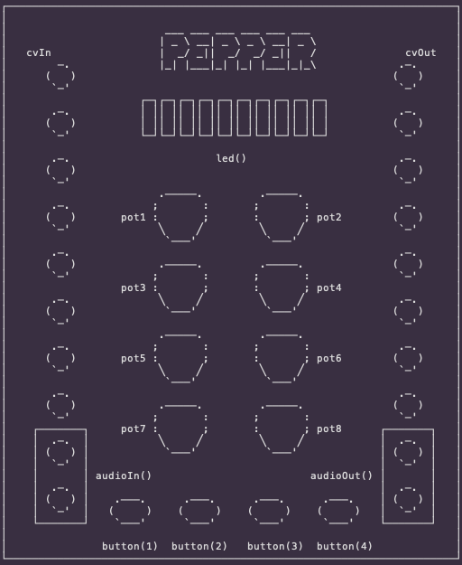

# libpepper

A small, single-header C++ library for the [Bela Pepper](https://github.com/BelaPlatform/Bela/wiki/Pepper)
Eurorack module.



Usage is simple: You extend from `Pepper`, implement two callbacks — `control()`
(analog/CV rate) and `audio()` (audio rate).

```cpp
#include "Pepper.h"

class Drone : public Pepper<Drone> {
  float phase = 0.f, freq = 110.f;

public:
  Drone() : Pepper<Drone>(scopeCfg()) {} // enable the Bela scope

  void control() {
    freq = 55.f * (1.f + 7.f * pot(1)); // knob 1 -> pitch
    led(1, button(1));
    cvOut(1, phase); // ramp LFO out
    scope(phase); // watch the ramp in the IDE scope
  }
  void audio() {
    float s = sinf(phase * 2 * M_PI);
    audioOut(1, s);
    audioOut(2, s);
    phase += freq / audioRate();
    if (phase >= 1.f) phase -= 1.f;
  }

private:
  static PepperConfig scopeCfg() {
    PepperConfig c;
    c.scopeChannels = 1; // 1-channel scope at control rate
    return c;
  }
};

PEPPER_MAIN(Drone)
```

Set `scopeChannels` in the config and call `scope(...)` with that many values from
`control()` to view signals live in the Bela IDE scope.
